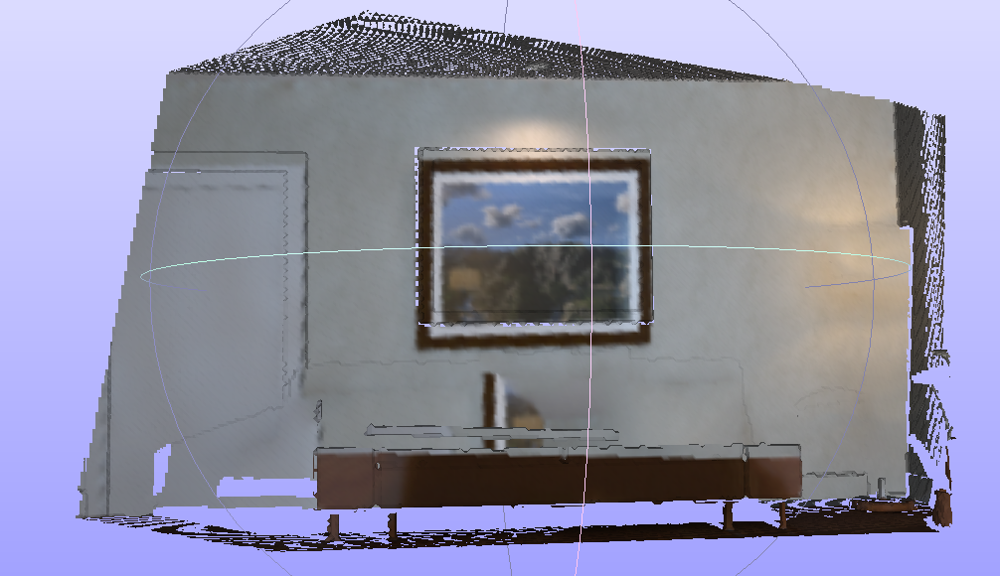

# 
 SMAC: A Simultaneous Mapping and Completion System for RGB-D Sensors
## Abstract
We propose a versatile simultaneous mapping and completion system for indoor scenes, which aims to provide semantic, lightweight and complete 3D dense models for virtual reality applications. In order to reconstruct complete environments, on the one hand, we provide an image synthesis strategy aimed at restoring 2D pixels occluded by objects. On the other hand, the depth information of these occluded parts is calculated based on a ray casting approach. After restoring the 3D occluded areas, we take advantage of a resolution adaptive TSDF algorithm to build lightweight 3D models according to the texture information of scenarios.

The overview of the SMAC system is shown as below:

The system is tested in multi living room SLAM datasets, such as the ICL datasets and TUM RGB-D datasets, the following video is the experimental results in ICL livingroom environment.

<iframe src="//player.bilibili.com/player.html?aid=719215259&bvid=BV1uQ4y1U7u4&cid=441039172&page=1" scrolling="no" width="720" height="540" border="0" frameborder="no" framespacing="0" allowfullscreen="true"> </iframe>

In this video, you can see that these blue planar points show the results of sparse map completion.  For a pair of RGB-D images, we firstly extract the geometric-interested (planar and non-planar) and semantic-interested (objects) regions that are used to analyze the occlusion situations. Commonly, those obscured areas are distributed on walls and floors. After detecting occlusion masks, we project these points to the world position and update these non-planar points, thus we can know the non-planar points in the map, then we use the ray-casting method to finish the sparse map completion, we compute the linear equation between the camera center and the non-planar points, then we use multi-geometric constraints to calculate the most appropriate cross point, finally we can get the sparse map completion. 

However, the occlusion phenomenon that appears in a certain view is possibly observed in new views. Therefore, it is important to update the predicted boundary lines and occluded planes created by each key-frame. After a new key-frame being selected, we project the completion information to the current frame, and the points that fall outside the non-planar area will be deleted. Furthermore, the endpoints of boundary lines are updated when related planar regions grow up.

What's more, it's not enough to acquire only the sparse map completion, so we complete the dense map reconstruction at the same time. We take advantage of the occlusion masks to separate them into different parts according to the cross-line between every two planes. In this way each occlusion part will not be affected by other regions, and the process of image synthesis can be accelerated using parallel computing method, which is more efficient than traditional method.

We use the Laplacian Patch-Based Image Synthesis [1] as the method of our RGB image synthesis, we raise a new method about the depth image synthesis, firstly we detect the occlusion areas in current image and judge which plane this area belongs to, secondly we project the occlusion area to the world position, by using the planar equation, we can calculate the depth of the occlusion area, therefore the progress of depth image synthesis can be accomplished.

Here are the RGB image and Depth image without synthesis.

    
    

Here are the RGB image and Depth image after the progress of image synthesis.

    
    

Then we can use these images to complete the dense 3D reconstruction using the TSDF.

## source code

This work is under the instruction of Dr. Yanyan Li, Ph.D student in Computer Aided Medical Procedures & Augmented Reality, Technical University of Munich. There is still some work to be done such as data association. I will open source the code soon.

## reference
[1] J. H. Lee, I. Choi and M. H. Kim, "Laplacian Patch-Based Image Synthesis," 2016 IEEE Conference on Computer Vision and Pattern Recognition (CVPR), 2016, pp. 2727-2735, doi: 10.1109/CVPR.2016.298.  
