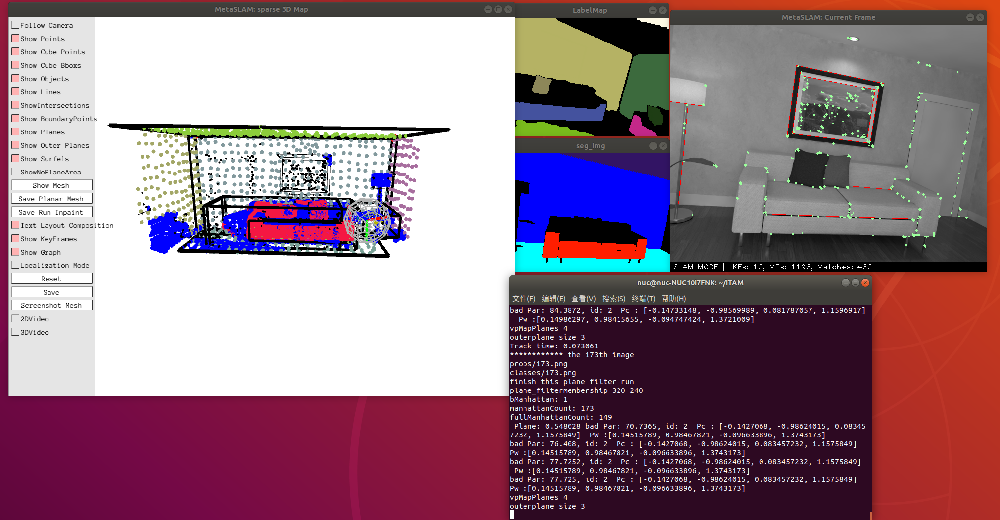
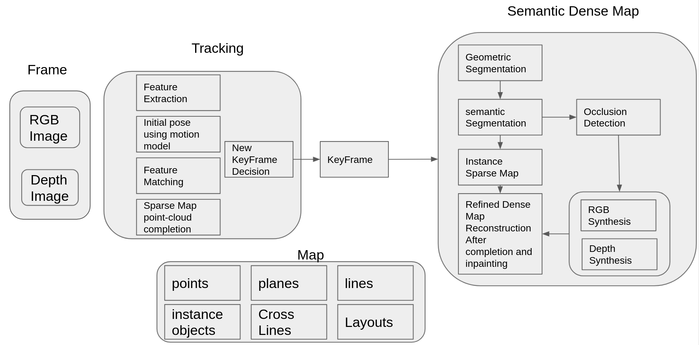

# 
 SMAC: A Simultaneous Mapping and Completion System for RGB-D Sensors
## Abstract
We proposes a versatile simultaneous mapping and completion system for indoor scenes, which aims to provide semantic, lightweight and complete 3D dense models for virtual reality applications. In order to reconstruct complete environments, on the one hand, we provide an image synthesis strategy aimed at restoring 2D pixels occluded by objects. On the other hand, the depth information of these occluded parts is calculated based on a ray casting approach. After restoring the 3D occluded areas, we take advantage of a resolution adaptive TSDF algorithm to build lightweight 3D models according to the texture information of scenarios.

The overview of the whole SAMC systems is shown as below:

The system is tested in multi living room SLAM datasets, including the ICL and Scannet, TUM RGB-D datasets, the following videos are the experimental results.

<video id="video" controls="" preload="none">
    <source id="mp4" src="./demoICLlr0.mp4" type="video/mp4">
</video>

